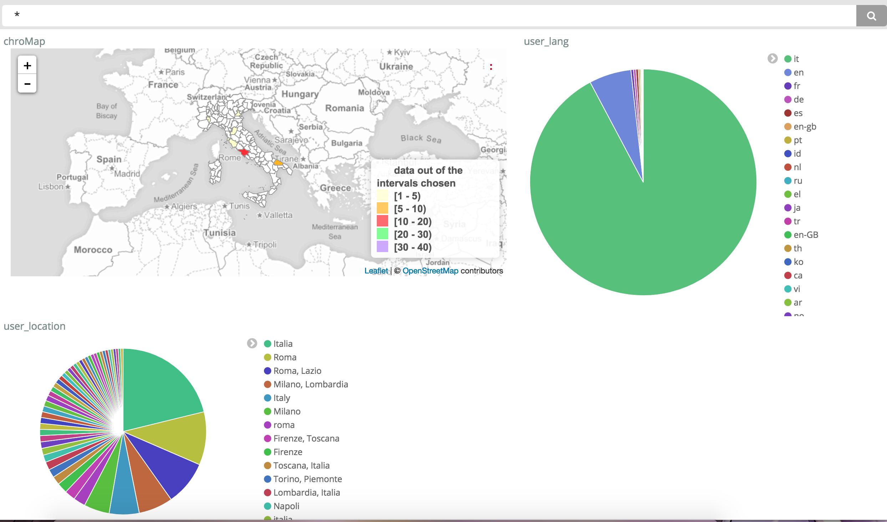

# A KIBANA PLUGIN FOR CHOROPLETH MAPS


### License

A KIBANA PLUGIN FOR CHOROPLETH MAPS
Copyright (C) 2017  Margherita Gambini

This file is part of choropleth_map.

choropleth_map is free software: you can redistribute it and/or modify
it under the terms of the GNU General Public License as published by
the Free Software Foundation, either version 3 of the License, or
(at your option) any later version.

choropleth_map is distributed in the hope that it will be useful,
but WITHOUT ANY WARRANTY; without even the implied warranty of
MERCHANTABILITY or FITNESS FOR A PARTICULAR PURPOSE.  See the
GNU General Public License for more details.

You should have received a copy of the GNU General Public License
along with choropleth_map.  If not, see <http://www.gnu.org/licenses/>.

### Description

This plugin integrates the possibility to create a new type of visualization for elasticsearch data by displaying them in a multi-layer choropleth map. A [choropleth map](https://en.wikipedia.org/wiki/Choropleth_map) is a thematic map in which areas are shaded or patterned in proportion to the measurement of the statistical variable being displayed on the map, such as population density or per-capita income. In particular with this plugin you can visualize how georeferenced data are distributed all over the world, in a normalized way or not. As it will be exaplained later, the user can choose among four types of layers (countries, regions, italy_provinces and italy_municipalities) and for each of them the map will color accordingly.

### Requirements
- Kibana 5.x+ or 6.0.0 (Kibana dev)
- Node.js
- npm
- elasticdump

### Installation
1. start your elasticsearch: ```$ path_to_elasticsearch_folder/bin/elasticsearch```
2. ```$ cd path_to_kibana_folder/plugins```
3. ```$ git clone "https://..."```
4. ```$ cd kibanaChoroplethMap```
5. For default the plugin establishes a connection with elasticsearch on ```HOST="localhost"``` and on ```PORT="9200"```, but you can change these parameters by editing the ```install.bash``` file in the ```kibanaChoroplethMap``` folder. Then execute the command

```$ ./install.bash```

  For debugging:

	For es_countries.json you should have Writes:254
	For es_regions.json you should have Writes:3609
	For es_italy_provinces.json you should have Writes:113
	For es_italy_municipalities.json you should have Writes:7998


### Usage

#### Attention

The index containing the georeferenced data that you want to analyze needs to have:
1. one or more fields of type GEO_POINT
2. one or more fields (corresponding to the previous ones) of type [GEO_SHAPE](https://www.elastic.co/guide/en/elasticsearch/reference/current/geo-shape.html) POINT.

This is needed because at present geo_shape queries can't be executed on geo_point field types, thus you have to do those queries on a geo_shape field of type Point.
Nonetheless the geo_point field is useful to restrict the number of geo_shape borders on which making the geo_shape queries. You do this by creating a geo_bounding_box on the georeferenced data (geo_point field, can't be done on the geo_shape field of type Point) and intersect it with all the geo_shape borders contained in the 'world' index.

For example:

INDEX MAPPING:

```json
  {
		...
		"coordinates":{"type":"geo_point"},
		"geo": { "type": "geo_shape","tree":"geohash","precision":"1m","points_only":true},
		..
	}
```
Read the ['Accuracy' section](https://www.elastic.co/guide/en/elasticsearch/reference/current/geo-shape.html) to understand how to set the precision field (anyway 1m is okay for our purpose);

INDEX DATA:
```json
	{
		...
		"coordinates":[9.491,51.2993],
		"geo":{"type":"point","coordinates":[9.491,51.2993]},
		...
	}
```

Pay attention to how the coordinates are written: the geo_shape field always wants [lon,lat], instead the [geo_point](https://www.elastic.co/guide/en/elasticsearch/reference/current/geo-point.html) field can be written in several ways like "lat,lon" - [lon,lat] - "lat": latitude_number, "lon": longitude_number - as a geo_hash "drm3btev3e86"

If your index data come only with the geo_point field then you have to build a script and add the geo_shape field.

Inside this repo I will include an index and the associated script as example. The data that you find inside this folder already has the two requested fields, so don't use the script on them. That script can help you to add the geo_shape Point field to others index you've downloaded.
To load that index on Elasticsearch (MAKE SURE YOU HAVE 'ELASTICDUMP' INSTALLED):

1. start your elasticsearch: ```$ path_to_elasticsearch_folder/bin/elasticsearch```
2. ```$ cd path_to_kibana_folder/plugins```
3. ```$ cd kibanaChoroplethMap/index_example```
4. ```elasticdump --input=index_schema.json --output=http://localhost:9200/<index_name> --type=mapping```
5. ```elasticdump --input=index_data.json --output=http://localhost:9200/<index_name> --type=data```

#### Let's begin

- ChoroplethMap Visualization

	

- Select the index containing the georeferenced data (first modify it as explained previously)

	

- If the selected index doesn't contain any geo_point fields and/or geo_shape (of type point) fields then an error is shown. You have to create a new visualization and select a different index.

	

	Otherwise this screen is shown:

	

- Select the index containing the borders shapes, which was created while executing the script install.bash. For default is called WORLD.

	

- Choose if you want normalized data or not.

	

- Choose how to show data (in a linear, logarithmic or customizable way).

	

	- In the customizable way you can choose the ranges and the colors to display, but know that the data that will be shown are the linears ones: result/population (if normalized) or result (if not normalized). Usually if you want normalized data the results are >= 0 but < 1 .

	

  

  Unfortunately on Safari you have to write the color yourself (es: "white", "rgb(255, 255, 255)" or "#ffffff")

- Choose the layer to show.

	

- Choose the geo_shape (of type point) field and the geo_point field (if you won't, an error will be shown)

	

	

- Click the PLAY BUTTON


- Sometimes the queries can be really long, so you have to wait a little bit (maximum 30 seconds) for the data to be shown.

	

- if you move the mouse's pointer on a shape, the result (linear or logarithmic) will be displayed in the upper right corner.

	

  Note: if you choose the logarithmic displaying, where there's no data it will be shown "-Infinity" (as log(0) is not defined)

  

- You can use filters as in every visualization. Let's start from this:

	

  

	1) if you click on a shape which has some data, a geo_bounding_box, regarding that shape, will appear on the filter bar and the map will display only that clicked area. If that area doesn't containg data no filter will be shown.

	

	2) if you write a query_string in the "search" input than the results will change accordingly (sometimes you have to wait a little bit to see those changings, for the queries could be long)

	

#### Dashboard
- Save a choroplethMap visualization and add it to a dashboard with other relatives visualizations.

  

- The filters that appear by clicking on a visualization will be applied also to our choroplethMap (wait a little bit as usual)

  

  Note: sometimes, when you choose a filter, there are no georeferenced data (the geo_point field is null). In this case an error will appear:

  

- You can add more than one choropleth map visualization (**save them with different names**)

  

  and add filters:

  

### Contact
marghe_943@yahoo.it
